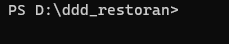
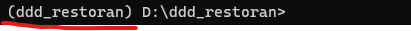
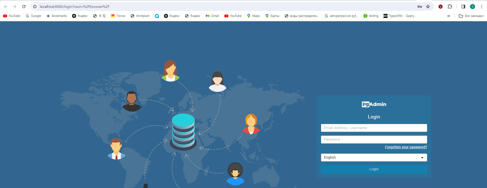
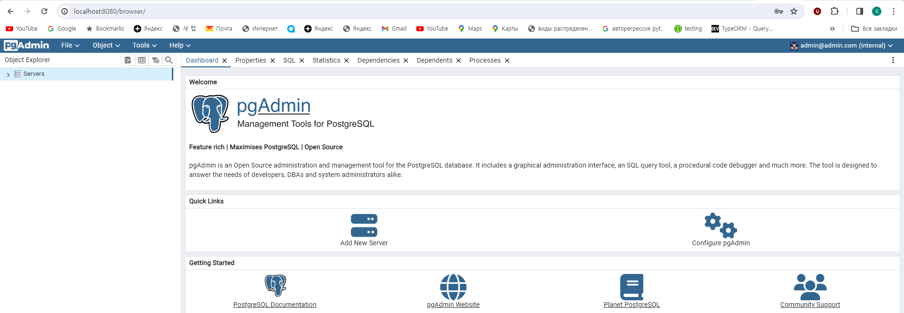
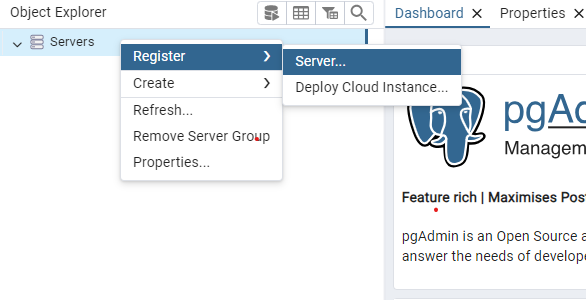
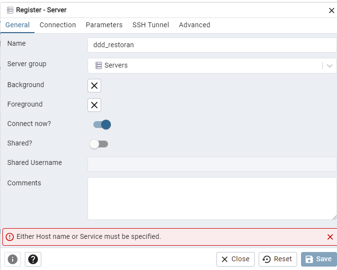
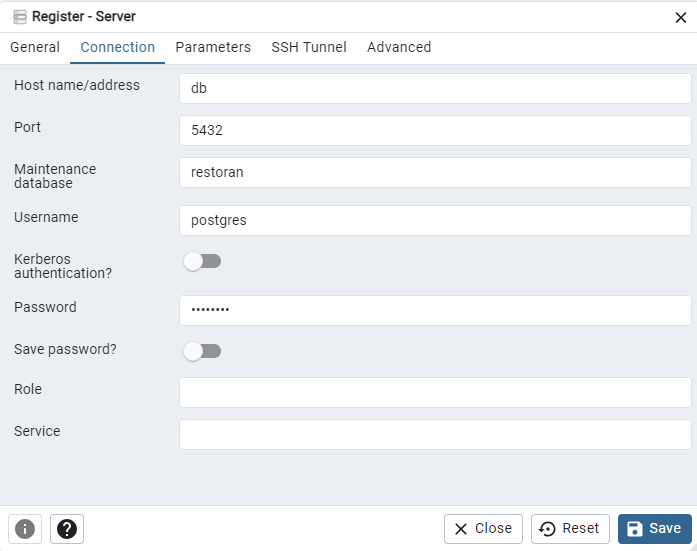
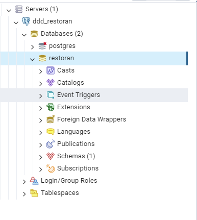
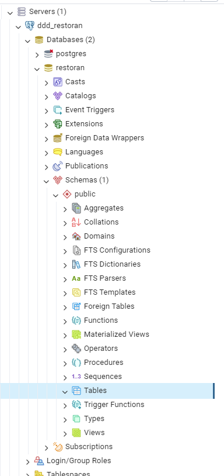
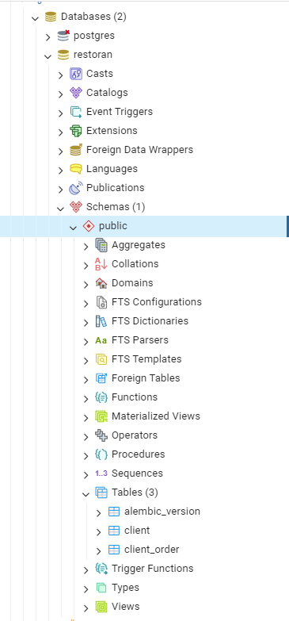

# Домашнее задание № 1

## 1. Настройка виртуального окружения.

Как настроить виртуалльное окружение можено посмотреть [тут](https://www.geeksforgeeks.org/creating-python-virtual-environment-windows-linux/)

Если всё сделано правильно, то после активации можно увидеть в power shell

_до активации_ \

_после активации_ \

после активации следует установить все зависимости через слеудующую команду в power shell

    pip install -r requirement.txt

## 2 Настройка окружения

Сперва запускаем докер контейнеры для базы и pgadmin находясь в директории docker_compose через следующую команду в power shell

    docker-compose up -d

при успешном запуске, можно будет через браузер зайти в pgadmin под адрес http://localhost:8080/browser/

login: admin@admin.com \
password: password

после входа можно увидеть

регистрируем сервер

в появившем окне заполняем слд данные

пароль: postgres

после нажимаем кнопку "save"

после можно увидеть, что создался коннекшен к базе

можно увидеть, что пока в базе нет ни одной таиблицы, но это скоро изменитсяч XD

## Миграции своими руками

Пора создавать таблички в базе через alembic

Примеры миграции можно увидеть в директории

    ddd_restoran\migration\versions

Новую миграцию можно создать через команду

    alembic revision -m "your_migration_name"

Можно увидеть, что в директории создалась новая пустая миграция.

### Цель домашнего задания

Целью данного домашнего задания будет создание миграции для табличек Menu и User

Схему базы данных можно увидеть [тут](https://viewer.diagrams.net/?tags=%7B%7D&highlight=0000ff&edit=_blank&layers=1&nav=1&title=%D0%B0%D1%80%D1%85%D0%B8%D1%82%D0%B5%D0%BA%D1%82%D1%83%D1%80%D0%B0_%D1%80%D0%B5%D1%81%D1%82%D0%BE%D1%80%D0%B0%D0%BD.drawio#R7Z3bcts2EIafxjPtRTriSbIuI9lJ23HaNE6d%2BEoDizDFmCRUEIqsPH1BCdTBC8t0JHLpZGc8YxMEJRD7Adx%2FAa5PvGF6%2F1ay6eSdCHly4nbC%2BxPv7MR1Hd%2Fz9a%2BiZLEq6Xmnq4JIxqGptCm4jL9xU9gxpbM45PlORSVEouLpbuFYZBkfq50yJqWY71a7Fcnut05ZxEHB5ZglsPRTHKrJqvTU7W3Kf%2BdxNCm%2F2en2V2dSVlY2d5JPWCjmW0Xe%2BYk3lEKo1V%2Fp%2FZAnReeV%2FbK67s0jZ9cNkzxTVS4Q1399cvPYf%2BsM%2F%2BDzLzL581y9Mp%2FylSUzc8PjJC4%2BcNVktSj7IZ%2FHacIyfTS4FZm6NGc6%2Bng8iZPwgi3ErGhHrtj4rjwaTISMv%2Bn6LNGnHF2gT0tlzOx1dmpcFleaz5Q813XelzfnPCh6x%2B53Kl6wXJWtEUnCpnl8s2xfcWHKZBRnA6GUSE2l%2BSRW%2FHLKxkWduSa3aIhKy0bCri37iUvF77eKTFe%2F5SLlSi50FXO2a6xusD81h%2FMNQ45vyiZb%2FKy5Z4bbaP3JG9PqP4x17Zbm2fl%2FXhx%2BuYu7Z%2Blcff73zUffYmld%2FaGV9c2ppZGkuONDkQipyzOxMnucJA%2BKWBJHmT5M%2BG1xWdE7sR46r01xGodh8cmDXPd0nEUXy2pn%2Fqbkg7nzokjoy2%2BT5QiZ6Au5%2FoTBVMSZWvZEMNA%2Fum%2BGnd%2BCk0C3daiPnc2x%2FimqSzUUmW4%2Bi5eW45qLOS%2FYGEihmGI3a2qfjcDe8fM0FwYEryII3hE4sLbYBRzwlMUJodA4Cl1sFDyAwpTl%2BVxImhiap6GPTYMPaLiNZa5GGUs58dA4D46LDYQLXYaEERBoQAQNAsHZpcrfK79zddt%2FvTjL8qt%2B51Wv%2F4haGOlHBpfERPNMVNUVtU0SAUAi5dmM5OOB8nEdNTCGdqsO%2FvoEZJcEZA1DPqhMRlsEJOSAHAIUEtD1Yw%2FqR1lMzYRC0yigi0cXhpXmq%2B8lGJqGoQXKEUaW7lhCMUYEFpoUjdYmn0K3MYskD5e6MYlzmiEQqECXjTCSMMstEQSSjQetOnpORTuvgTi6aoTxAVKNh4%2F4fmUw2qIaSxK3QJAiIa3QPArostGDcwJFEFBQQJeNDlxiot0IOCzgq0YHxhBoPwIeD%2BjK0YFRhC3paF9yJMHwPMEQnO4qhqrCsD7BALehkGA4wsqyV5mM1igGuNAU8iTWd7AYjUU6ZdmCuGieC3T54EL5sHwWjEKmSEQgEIGuIlz4zFgRQUtQWEw0qibs7zvA1emN95gTEwhM4CsKyMTeDYykJp6nJh7uWqusJoK6ZgEYUiA1cYSx36tMRmvUBFyHHkuuPcYRIwcBAYgmZcT1rHN1c6fC4bt%2Fwqt0cH02%2BPh39TdfCYbaYUBXEA7cj1BsYyc3EQEG%2FIUId590ICfxQCfR79QQcjbf9oGPFcuiYl%2FBM76uXwEuliguM%2B0vDMQsC3PA2Po%2Bv99XtSx3kK968ATkvkBfFcazaIMEDgvo0W4HRruXL1mMplyO7iJionkm0L1VF66M8ftpLJmKRTYKGa2LIVCBH%2FGGXmuhYUaRZCkBgQBEo%2B%2Fr24CAIa9LJST0I0jBHKZgjhPn%2FhEkDAyjkIR5Fot7x3ErFYx98RXu9t8TQSEg6gaiSRljBwJK2rx4Fo2yWXpDqWMQkGhSxdiRsGSkzL7quxTLZv5yF%2F1KWDSORbMyxpZlilLS1uS2OrteZLdT1Ws9yl5vm6ldchcPHPP7BlA73UVbi%2BHKB70FhoNCo46ircXQT6R3wNBoaNRHtLUYLn5QTlpEHvCdQ7jyQSlpEXnAT0kLeKD0o0eQCkGwqxV6Xb%2BaoY%2BTftRmaUseKXIJDh7yrd4cY20xXGKgyR%2BFBHSpYFlkoPyjOCygCwVLMJle%2FkSCAV8l9KBupPyjOCygKwRLVqEi1eSIvEcMHJpMPGrHAQYYKfPoERSj5%2B0qxr5f0dL1rS5Ztk7ToD9ClMivzEZbNKMllRAlH8VhAV81wpAhBRBwWMBXjTCoSAvPSDDgq0bLS%2BC09owIBLp0LImkBKQ1bkpzHvzPgspLTTVuS7PsTKUp4OApYD2cXo5wcGHwiHKQ4nOBLiIs%2F%2BCKcpBiEoEuJSgHaeuYwFcUllTFy7eeKK8UBg74eoLSj9abfvS733BxazM5bVurZfS%2FvH1rPpQSZvATEBhA4GsIGG6kjLSIQKBLCM%2F2QjSlnTySc9B%2FGGesqg5cf4%2FBzde9mKQtVu7gk4keSYfPQF51RNvio3gwrEVr4zgsoLsnnuVNXEo8icoEvocC41mUeBKbCvwwpwe311HmSUwi8COdkIitnRPkXaJQgb73vgfj36skcAQEBhDrcDnegwMCQRlqjxHs6D14f79f1UfYuxLyQwQ7aEGmltnnBS7IwN2dlJIUlwn0oIdPOUnbyAV64CN4LCnpaufGiJIOHcFp8f1dJyKonFa%2Ftu0bAS2N1DEDBM%2FWKujeQvDYjl%2FiAYMHdE8hgMsjy5gn4YCBA7qD0HWA2XkY8fKZr7twIiKRseR8U6p7T6tcHpq%2B29S5EGJqeuwLV2phnv1spsRuf%2BpulIvP5vrlwXVxoI1nDs%2Fut0%2BeLczRow%2FrXMzkmO%2B5T%2FM81B5JxPeZsNztVnTCXgNKnjAVf%2BU7zTi%2BebyfxDynFe1TPs7aYh8f1T5OU%2FapbB6%2FXeaB676rhx1tT6srYnucves%2FQsS2a1lLJCfrYCdrPaZfjgbrPvIfLgkHDBzQJVhv335pggIFCnQh1nN%2FDk%2B%2FqidZzpkt8SR7uEKsMUe%2F3FP%2FpH3KSawt9kERYt%2Ffz2XFJ%2Fu53JHWln7u%2FhzTVJmD80n7lGl622Kf05c1Dryqz4NeU88DfSiFUNtaULshk3ci5EWN%2FwE%3D)

Примеры как писать миграции можно посмотреть на 1a9343440bef_create_client_table и 52bd5de529e6_create_client_order_table

после написания миграции, нужно запустить миграции через следующую команд в power shell

    alembic upgrade head

Если миграции прошли без ошибок, то можно увидеть в pgadmin, что появились таблицы

